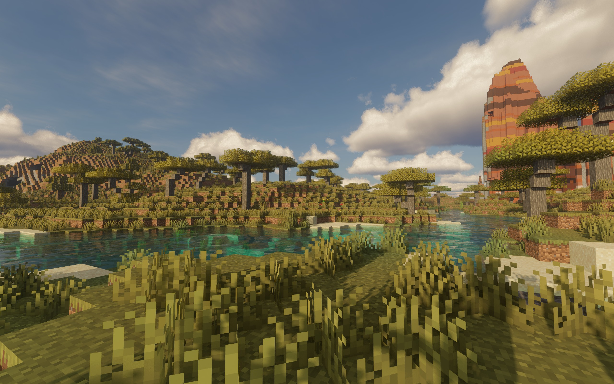
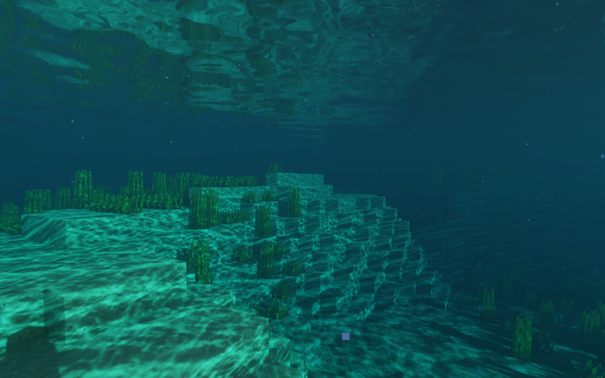
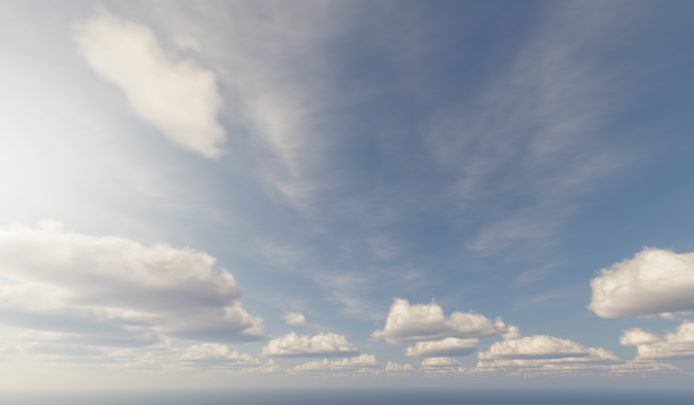

# Vibroscat

[English](README.md) | [简体中文](README.zh-CN.md)

Vibroscat is a high-end Minecraft shaderpack for Iris. It gives the world
natural daylight, deep cloud cover, clear water, soft shadows, and a restrained
cinematic finish while preserving Minecraft's block-shaped character.

## Development status

Vibroscat is in early development. Many effects are not implemented yet, and
parts of the code may have quality or maintainability issues. Expect visual
defects, incomplete settings, and breaking changes between versions.

AI generated a large portion of the code. The author reviewed and extensively
revised that code, and designed the rendering pipeline architecture.

## Screenshots

All screenshots were captured in game at 2560 pixels wide with the default
Vibroscat profile.

## Effects

- Layered volumetric clouds with changing density, soft edges, sunlight, and
  cloud shadows
- Daylight, sunsets, moonlight, stars, horizon haze, and distance fog
- Clear water with waves, reflections, refraction, underwater fog, light
  shafts, and moving caustics
- Soft sun shadows, contact detail, ambient shading, and light passing through
  foliage
- Stable antialiasing, automatic exposure, bloom, depth of field, motion blur,
  sharpening, and filmic color

## GPU support

Vibroscat targets modern desktop and laptop GPUs with current drivers.

| Vendor | Supported range | Practical starting point |
| --- | --- | --- |
| NVIDIA | GeForce GTX 900 series and newer | GTX 1060 6 GB at 1080p Low |
| AMD | Radeon RX 400 series and newer | RX 580 8 GB at 1080p Low |
| Intel | Arc A-series and newer | Arc A380 at 1080p Low |

GeForce RTX, Radeon RX 5000/6000/7000, and Intel Arc GPUs are the main target.
Integrated Intel UHD, Iris Xe, Radeon Vega, and Radeon 700M graphics are below
the intended performance range.

## Requirements

- Minecraft Java Edition 26.2
- Fabric Loader 0.19.x
- Iris and Sodium builds made for Minecraft 26.2
- Java 21
- Windows or Linux with an up-to-date GPU driver
- 8 GB system memory minimum; 16 GB recommended
- 4 GB VRAM for Low; 6 GB for Medium or High; 10 GB for Ultra at 4K
- 4 GB of Java heap and a 12 to 16 chunk render distance as a starting setup

## Quality profiles

| Profile | Suggested hardware and resolution |
| --- | --- |
| Low | GTX 1060 6 GB, RX 580 8 GB, or Arc A380 at 1080p |
| Medium | RTX 2060/3060, RX 6600/7600, or Arc A580/A750 at 1080p or 1440p |
| High | RTX 3070/4070, RX 6800/7800 XT, or Arc A770 at 1440p |
| Ultra | RTX 4080/4090, RX 7900 XT/XTX, or newer high-end GPUs at 4K |

Start with Medium at 1080p. Lower cloud and shadow quality first when more
performance is needed. Ultra renders clouds at full resolution and is intended
for high-end GPUs.

## Installation

Download the release archive and place it in the `shaderpacks` directory. Keep
the archive intact, or extract it so that `shaders` is directly inside the
Vibroscat folder. Select Vibroscat from the Iris shader-pack menu, then choose a
quality profile in Shader Pack Settings.

## License

Vibroscat is released under GPL-3.0. See [LICENSE](LICENSE) and
[third-party notices](licenses/THIRD_PARTY_NOTICES.md).
